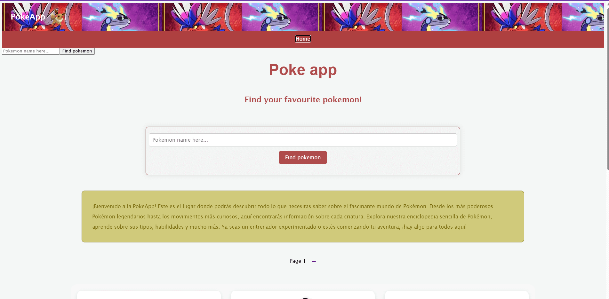
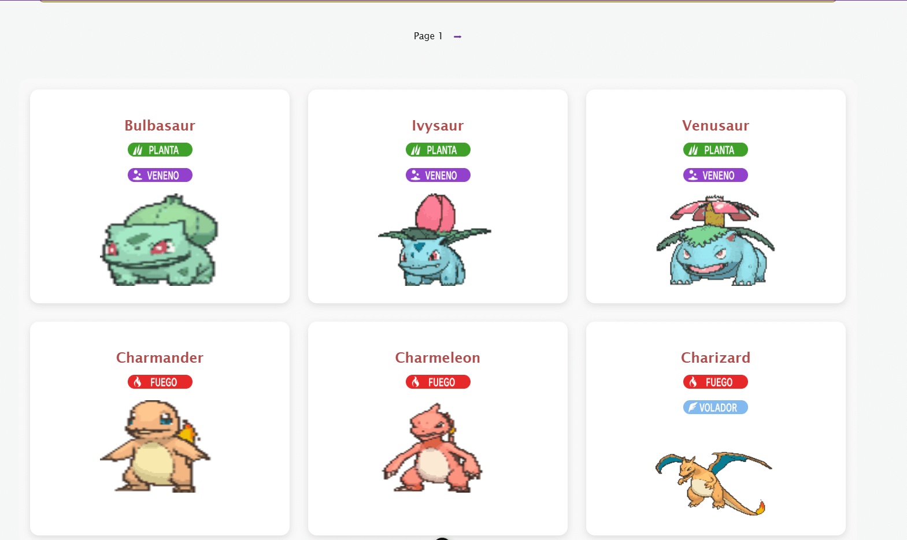
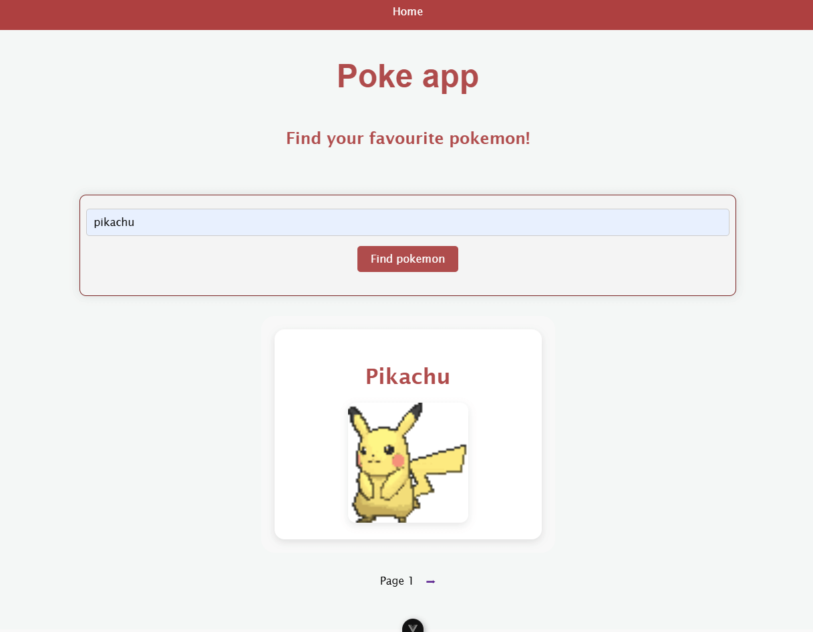
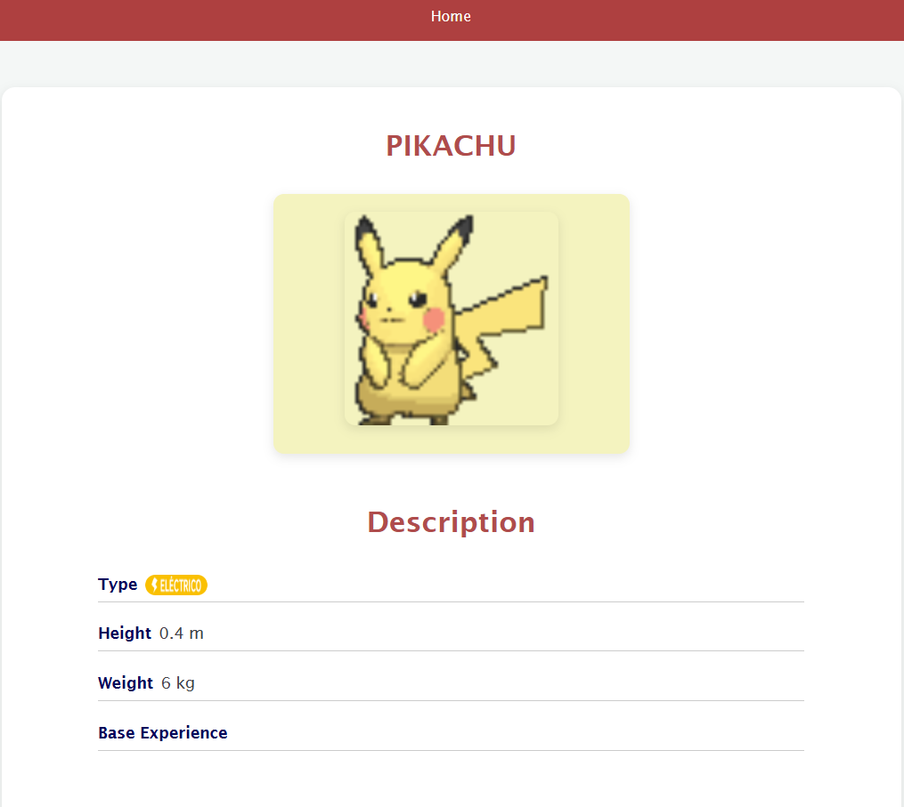
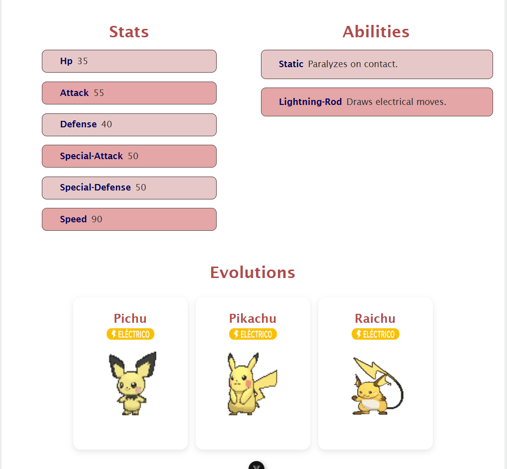
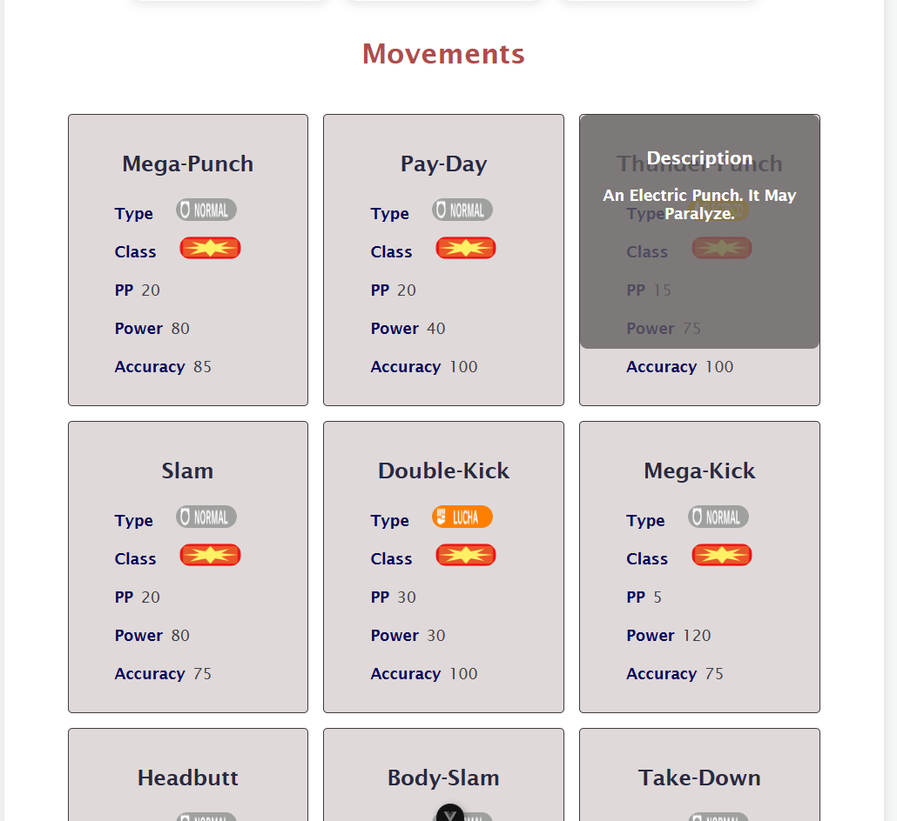
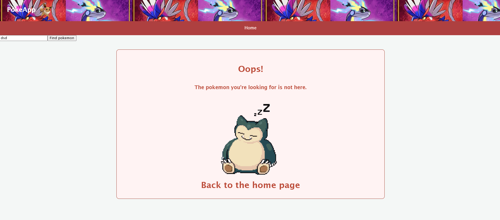

# Poke App ⚡
Bienvenido a la Poke App, tu pokedex de confiaza, en el que podrás buscar tus pokemon favoritos y sus característcas.


## Vista previa de la app
1. Página principal
<div align = "center">
   
</div>

2. Paginación en la página principal
<div align = "center">
   
</div>

3. Buscador con muestra de resultados
<div align = "center">
   
</div>

4. Resultados del pokemon, características
<div align = "center">
   
</div>

5. Resultados del pokemon, estadísticas, habilidades y evoluciones.
<div align = "center">
   
</div>

6. Resultados de los movimientos con descripciones
<div align = "center">
   
</div>

7. Página de error por pokemon no encontrado
<div align = "center">
   
</div>

## Instalación y ejecución del proyecto

1. Instalación de dependencias

```sh
npm install
npm install axios
```

2. Ejecutar el proyecto

```sh
npm run dev
```

3. Compile and Minify for Production

```sh
npm run build
```

4. Lint with [ESLint](https://eslint.org/)

```sh
npm run lint
```
